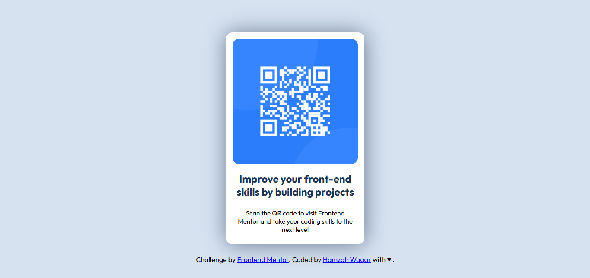

# Frontend Mentor - QR code component solution

## Overview
This is a solution to the [QR code component challenge on Frontend Mentor](https://www.frontendmentor.io/challenges/qr-code-component-iux_sIO_H).

### Links

- Solution URL: [View Me](https://hamzawaqar82.github.io/QR-Component/)
- Live Site URL: [View Me](https://hamzawaqar82.github.io/QR-Component/)

### Built with

- Semantic HTML5 markup
- CSS custom properties
